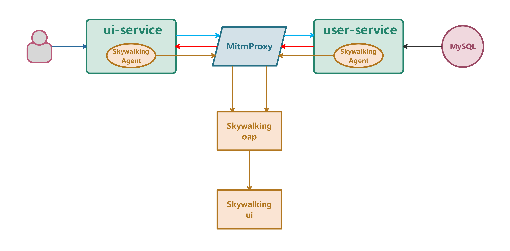
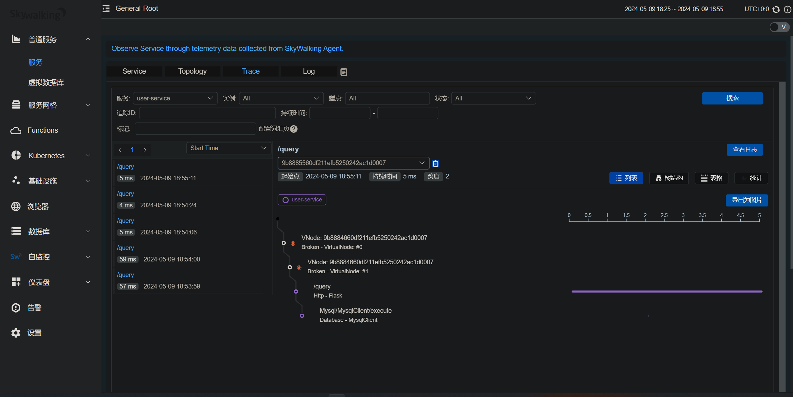

# Microservice-Testing-Demo

## Architecture



### Flask

+ ui-service : 
  + `/` : Show "ui-service" in the web page to test if the service is healthy.
  + `/httptest` : Request user-service to test if the http connect is normal.
+ user-service : 
  + `/query` : Execute MySQL query and answer ui-service's `/httptest` request.

### MitmProxy

The mitmdump which runs in the mitmproxy container.

+ `-w /home/mitmproxy/dumpfile.txt` : Dump all flows in a origin format.
+ `-s /home/record_filter_oap.py` : Execute the `record_filter_oap.py` addon (the custom scripting specification for mitmproxy) to filter the flows to host oap-server, and dump the other flows in a more-readable format.

### Skywalking

+ Deploy skywalking python agent for ui-service and user-service to trace them automatically (including SQL execution). 
+ skywalking-ui : The web-based user interface for visualizing and analyzing the tracing and monitoring data collected by the SkyWalking system. 
+ skywalking-oap : The storage and analysis backend.

## Deployment

Use docker compose :

``` shell
docker-compose up --build -d
```

## View data

+ The SkyWalking traces : `localhost:8890`
  

+ The MitmProxy flows : In the directory that build docker compose.

  + `./mitmproxy/dumpfile.txt`. Like :

    ``` shell
    1906:9:websocket;0:~8:response;446:6:reason;11:Bad Gateway,11:status_code;3:502#13:timestamp_end;17:1715251860.885858^15:timestamp_start;17:1715251860.884831^8:trailers;0:~7:content;225:Cannot connect to oap-server:11800: [Errno 111] Connect call failed ('172.29.0.2', 11800) If you plan to redirect requests away from this server, consider setting `connection_strategy` to `lazy` to suppress early connections.,7:headers;28:24:14:content-length,3:225,]]12:http_version;8:HTTP/1.1,}7:request;307:4:path;0:,9:authority;16:oap-server:11800,6:scheme;0:,6:method;7:CONNECT,4:port;5:11800#4:host;10:oap-server;13:timestamp_end;0:~15:timestamp_start;18:1715251860.8822558^8:trailers;0:~7:content;0:~7:headers;69:27:4:Host,16:oap-server:11800,]34:10:User-Agent,16:grpc-httpcli/0.0,]]12:http_version;8:HTTP/1.1,}6:backup;0:~17:timestamp_created;18:1715251860.8824277^7:comment;0:;8:metadata;0:}6:marked;0:;9:is_replay;0:~11:intercepted;5:false!11:server_conn;446:3:via;0:~19:timestamp_tcp_setup;0:~7:address;22:10:oap-server;5:11800#]19:timestamp_tls_setup;0:~13:timestamp_end;0:~15:timestamp_start;18:1715251860.8829036^3:sni;0:~11:tls_version;0:~11:cipher_list;0:]6:cipher;0:~11:alpn_offers;0:]4:alpn;0:~16:certificate_list;0:]3:tls;5:false!5:error;53:[Errno 111] Connect call failed ('172.29.0.2', 11800);
    ```

  + `./mitmproxy/filter-oap.txt`. Like :

    ``` shell
    Request: {
      "timestamp": "2024-05-09T10:51:30.396450",
      "method": "POST",
      "url": "http://webapp2:5001/query",
      "http_version": "HTTP/1.1",
      "headers": {
        "Host": "webapp2:5001",
        "User-Agent": "python-requests/2.31.0",
        "Accept-Encoding": "gzip, deflate",
        "Accept": "*/*",
        "Connection": "keep-alive",
        "sw8-correlation": "",
        "sw8": "1-MTdjNjljZWUwZGYyMTFlZmIwODUwMjQyYWMxZDAwMDc=-MTdjNjliZjQwZGYyMTFlZmIwODUwMjQyYWMxZDAwMDc=-1-dWktc2VydmljZQ==-MDYxY2EyNWUwZGYyMTFlZmI4MTMwMjQyYWMxZDAwMDc=-L3F1ZXJ5-d2ViYXBwMjo1MDAx",
        "Content-Length": "16",
        "Content-Type": "application/json"
      }
    }
    
    Response: {
      "timestamp": "2024-05-09T10:51:30.413336",
      "status_code": 200,
      "reason": "OK",
      "http_version": "HTTP/1.1",
      "headers": {
        "Server": "Werkzeug/3.0.3 Python/3.11.2",
        "Date": "Thu, 09 May 2024 10:51:30 GMT",
        "Content-Type": "application/json",
        "Content-Length": "22",
        "Connection": "close"
      }
    }
    ```

    

